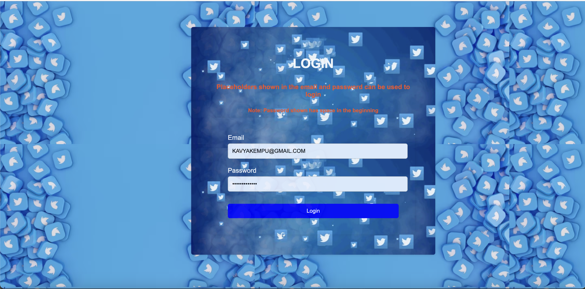
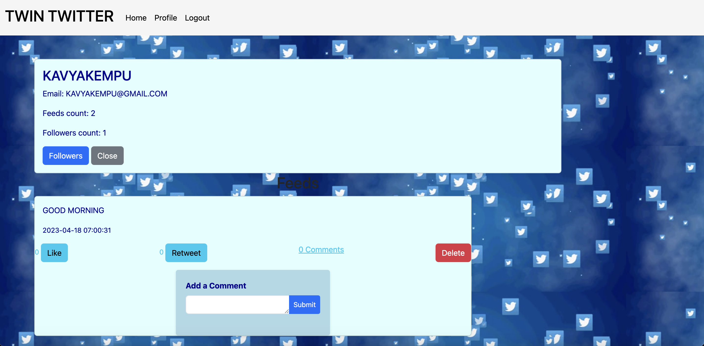
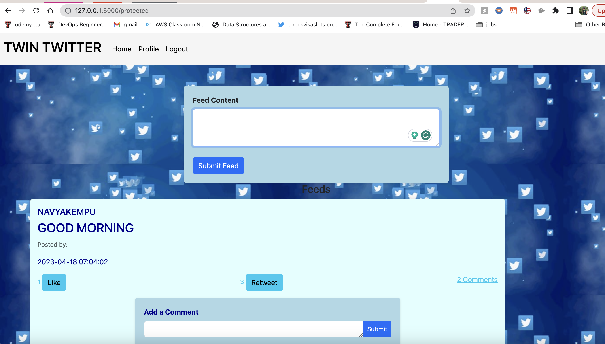

# Twin_Twitter

## Flask Application with MySQL Database Connection

This Flask application provides a simple web interface that connects to a MySQL database and includes features such as a login page, user profile, and explore functionality. The application is built using Python and the Flask framework.

## Requirements

Make sure you have the following installed on your system before running the application:

- Python (version 3.6 or higher)
- Flask (version 1.1.2 or higher)


To easily install the necessary packages, you can create a `requirements.txt` file with the following content:

```
pip install Flask

pip install Flask mysql-connector-python 

pip install Flask flask-login


```

You can install these requirements by running the following command:

```shell
pip install -r requirements.txt
```

## Database Configuration

Before running the application, you need to configure the MySQL database connection in app.py. Follow the steps below:

```shell
import mysql.connector

def create_conn():
    return mysql.connector.connect(
        host="127.0.0.1",
        user="YOUR USERNAME",
        password="YOUR PASSWORD",
        database="YOUR DATABASE NAME"
    )
```
## Running the Application

To run the Flask application, follow these steps:

1. Open a terminal or command prompt and navigate to the project directory.
2. Run the following command to start the application:

   ```shell
   python app.py
   ```

3. Once the application is running, open a web browser and visit `http://localhost:5000` to access the login page.

## Features

This Flask application includes the following features:

### Login Page

The login page allows users to enter their credentials and log into the application. It verifies the user's information against the MySQL database and grants access if the certificates are valid.



### Profile

After logging in, users can access their profile page, which displays their personal information like email, no of followers, no of tweets. The tweets they posted are  retrieved from the MySQL database. Users can view and update their profile details, and view their followers.



### Explore

The explore functionality provides users with the ability to view the tweets posted by you and the people you follow. It fetches relevant data from the MySQL database and presents it to the user in an organized manner.



Please feel free to customize and extend the application based on what you need. Happy coding!
